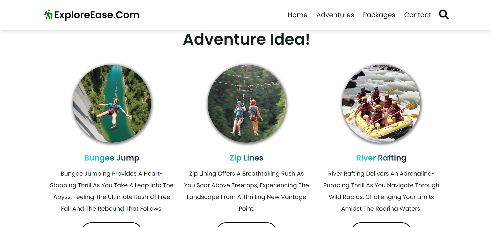
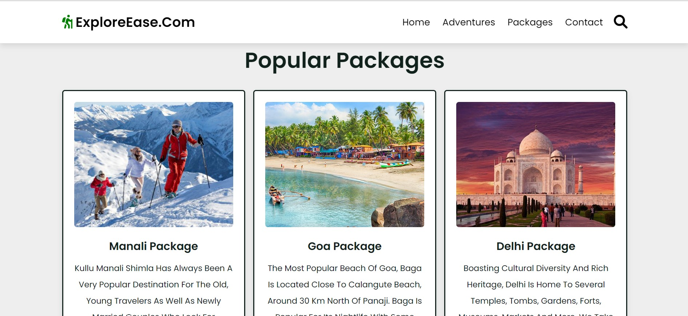
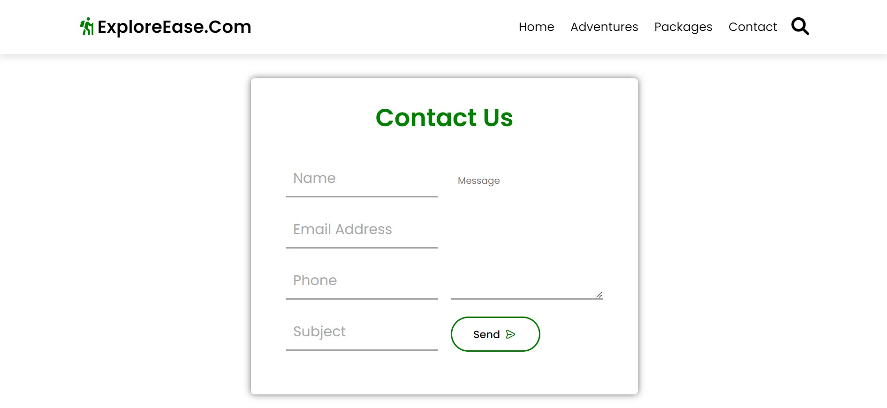

# TravelEase- A Tours and Travels Website

## Overview

The proposed Tours and Travel webpage aims to address the shortcomings of existing systems by leveraging modern web development technologies. Utilizing HTML5, CSS3, and JavaScript, this system will provide a robust and flexible structure, enabling dynamic and interactive content.

## Key Features

- **Responsive Design**: Ensures optimal viewing and interaction experiences across a wide range of devices, from desktops to smartphones.
- **Interactive Elements**: Implements features such as image sliders, interactive maps, and search filters to enhance user engagement.
- **Real-Time Updates**: Provides up-to-date information on travel destinations, availability, and booking status.
- **User-Friendly Interface**: Designs an intuitive and visually appealing layout that simplifies navigation and enhances the overall user experience.

## Objectives

By integrating these features, the proposed system aims to deliver a superior user experience, making it easier for users to explore travel destinations and book tours efficiently.

## Technologies Used

- **HTML5**: For structuring the content.
- **CSS3**: For styling and responsive design.
- **JavaScript**: For dynamic and interactive elements.

## Getting Started

To get started with this project, clone the repository and open the `index.html` file in your browser. For further development, make sure to have a basic understanding of HTML, CSS, and JavaScript.

## Contribution

Feel free to contribute to the project by submitting issues or pull requests. Your feedback and improvements are always welcome!

## License

This project is licensed under the MIT License. See the [LICENSE](LICENSE) file for details.

---

For more information, visit the [project page](https://github.com/yourusername/yourrepository).

